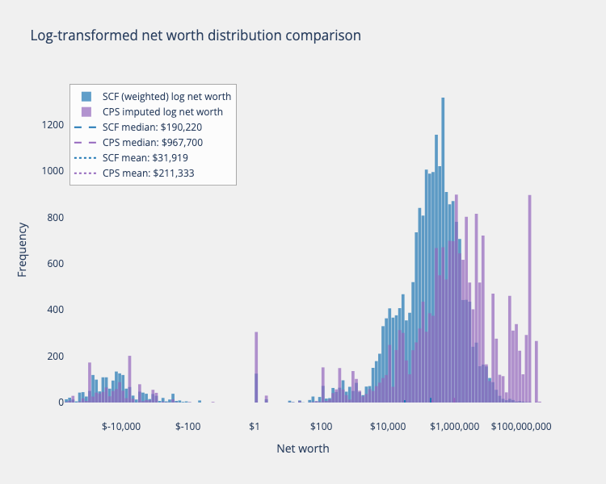
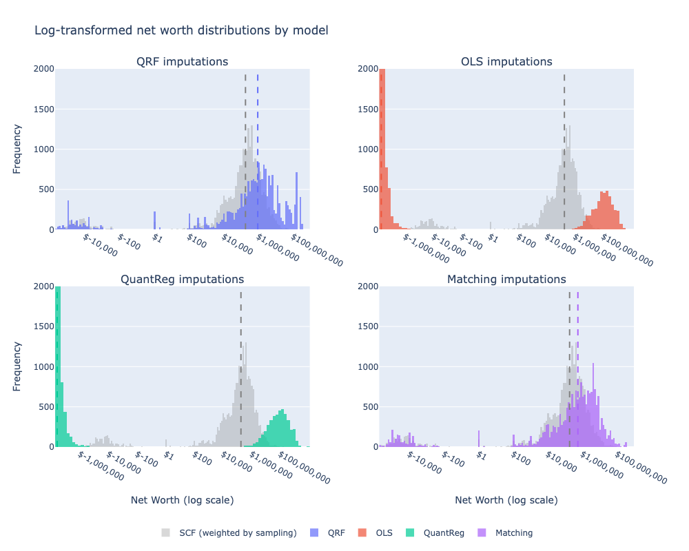
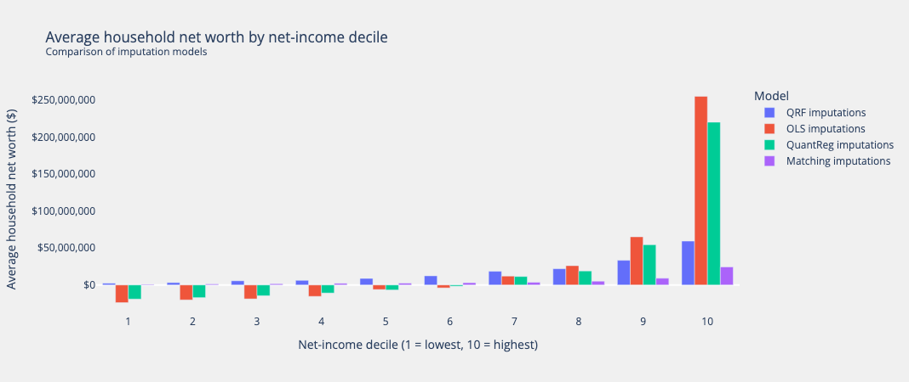

# Imputing wealth from the SCF to the CPS

This notebook demonstrates how to use the `microimpute` package and specifically the `autoimpute` function to impute wealth variables from the Survey of Consumer Finances to the Current Population Survey.

The Survey of Consumer Finances (SCF) is a triennial survey conducted by the Federal Reserve that collects detailed information on U.S. families' balance sheets, income, and demographic characteristics, with a special focus on wealth measures. The Current Population Survey (CPS) is a monthly survey conducted by the Census Bureau that provides comprehensive data on the labor force, employment, unemployment, and demographic characteristics, but lacks detailed wealth information.

By using `microimpute`, wealth information can be transfered from the SCF to the CPS, enabling economic analyses that require both detailed labor market and wealth data.

```python
import io
import logging
import zipfile
from typing import List, Optional, Union

import numpy as np
import pandas as pd
import requests
import plotly.graph_objects as go
from plotly.subplots import make_subplots
from pydantic import validate_call
from tqdm import tqdm
import warnings

from microimpute.config import (
    VALIDATE_CONFIG, VALID_YEARS, PLOT_CONFIG
)
from microimpute.comparisons import *
from microimpute.visualizations import *

logger = logging.getLogger(__name__)
```

## Loading and preparing the SCF and CPS datasets

The first step in the imputation process involves acquiring and harmonizing the two datasets. Extracting data from the SCF and the CPS, and then processing it to ensure the variables are compatible for imputation are crucial pre-processing steps for successful imputation. This involves identifying predictor variables that exist in both data sets and can meaningfully predict wealth, as well as ensuring they are named and encoded identically. 

```python 
@validate_call(config=VALIDATE_CONFIG)
def scf_url(year: int, VALID_YEARS: List[int] = VALID_YEARS) -> str:
    """Return the URL of the SCF summary microdata zip file for a year.

    Args:
        year: Year of SCF summary microdata to retrieve.

    Returns:
        URL of summary microdata zip file for the given year.

    Raises:
        ValueError: If the year is not in VALID_YEARS.
    """
    logger.debug(f"Generating SCF URL for year {year}")

    if year not in VALID_YEARS:
        logger.error(
            f"Invalid SCF year: {year}. Valid years are {VALID_YEARS}"
        )
        raise ValueError(
            f"The SCF is not available for {year}. Valid years are {VALID_YEARS}"
        )

    url = f"https://www.federalreserve.gov/econres/files/scfp{year}s.zip"
    logger.debug(f"Generated URL: {url}")
    return url


@validate_call(config=VALIDATE_CONFIG)
def load_scf(
    years: Optional[Union[int, List[int]]] = VALID_YEARS,
    columns: Optional[List[str]] = None,
) -> pd.DataFrame:
    """Load Survey of Consumer Finances data for specified years and columns.

    Args:
        years: Year or list of years to load data for.
        columns: List of column names to load.

    Returns:
        DataFrame containing the requested data.

    Raises:
        ValueError: If no Stata files are found in the downloaded zip
            or invalid parameters
        RuntimeError: If there's a network error or a problem processing
            the downloaded data
    """

    logger.info(f"Loading SCF data with years={years}")

    try:
        # Identify years for download
        if years is None:
            years = VALID_YEARS
            logger.warning(f"Using default years: {years}")

        if isinstance(years, int):
            years = [years]

        # Validate all years are valid
        invalid_years = [year for year in years if year not in VALID_YEARS]
        if invalid_years:
            logger.error(f"Invalid years specified: {invalid_years}")
            raise ValueError(
                f"Invalid years: {invalid_years}. Valid years are {VALID_YEARS}"
            )

        all_data: List[pd.DataFrame] = []

        for year in tqdm(years):
            logger.info(f"Processing data for year {year}")
            try:
                # Download zip file
                logger.debug(f"Downloading SCF data for year {year}")
                url = scf_url(year)
                try:
                    response = requests.get(url, timeout=60)
                    response.raise_for_status()  # Raise an error for bad responses
                except requests.exceptions.RequestException as e:
                    logger.error(
                        f"Network error downloading SCF data for year {year}: {str(e)}"
                    )
                    raise RuntimeError(
                        f"Failed to download SCF data for year {year}"
                    ) from e

                # Process zip file
                try:
                    logger.debug("Creating zipfile from downloaded content")
                    z = zipfile.ZipFile(io.BytesIO(response.content))

                    # Find the .dta file in the zip
                    dta_files: List[str] = [
                        f for f in z.namelist() if f.endswith(".dta")
                    ]
                    if not dta_files:
                        logger.error(
                            f"No Stata files found in zip for year {year}"
                        )
                        raise ValueError(
                            f"No Stata files found in zip for year {year}"
                        )

                    logger.debug(f"Found Stata files: {dta_files}")

                    # Read the Stata file
                    try:
                        logger.debug(f"Reading Stata file: {dta_files[0]}")
                        with z.open(dta_files[0]) as f:
                            df = pd.read_stata(
                                io.BytesIO(f.read()), columns=columns
                            )
                            logger.debug(
                                f"Read DataFrame with shape {df.shape}"
                            )

                        # Ensure 'wgt' is included
                        if (
                            columns is not None
                            and "wgt" not in df.columns
                            and "wgt" not in columns
                        ):
                            logger.debug("Re-reading with 'wgt' column added")
                            # Re-read to include weights
                            with z.open(dta_files[0]) as f:
                                cols_with_weight: List[str] = list(
                                    set(columns) | {"wgt"}
                                )
                                df = pd.read_stata(
                                    io.BytesIO(f.read()),
                                    columns=cols_with_weight,
                                )
                                logger.debug(
                                    f"Re-read DataFrame with shape {df.shape}"
                                )
                    except Exception as e:
                        logger.error(
                            f"Error reading Stata file for year {year}: {str(e)}"
                        )
                        raise RuntimeError(
                            f"Failed to process Stata file for year {year}"
                        ) from e

                except zipfile.BadZipFile as e:
                    logger.error(f"Bad zip file for year {year}: {str(e)}")
                    raise RuntimeError(
                        f"Downloaded zip file is corrupt for year {year}"
                    ) from e

                # Add year column
                df["year"] = year
                logger.info(
                    f"Successfully processed data for year {year}, shape: {df.shape}"
                )
                all_data.append(df)

            except Exception as e:
                logger.error(f"Error processing year {year}: {str(e)}")
                raise

        # Combine all years
        logger.debug(f"Combining data from {len(all_data)} years")
        if len(all_data) > 1:
            result = pd.concat(all_data)
            logger.info(
                f"Combined data from {len(years)} years, final shape: {result.shape}"
            )
            return result
        else:
            logger.info(
                f"Returning data for single year, shape: {all_data[0].shape}"
            )
            return all_data[0]

    except Exception as e:
        logger.error(f"Error in _load: {str(e)}")
        raise

scf = load_scf(2022)

# Create mapping from desired variable names to SCF column names
scf_variable_mapping = {
    "hhsex": "is_female",  # sex (is female yes/no) (hhsex)
    "age": "age",  # age of respondent (age)
    "race": "race", # race of respondent (race)
    "kids": "own_children_in_household",  # number of children in household (kids)
    "wageinc": "employment_income", # income from wages and salaries (wageinc)
    "bussefarminc": "farm_self_employment_income",  # income from business, self-employment or farm (bussefarminc)
    "intdivinc": "interest_dividend_income",  # income from interest and dividends (intdivinc)
    "ssretinc": "pension_income",  # income from social security and retirement accounts (ssretinc)
}

original_columns = list(scf_variable_mapping.keys()) + ["networth", "wgt"]
scf_df = pd.DataFrame({col: scf[col] for col in original_columns})
scf_data = scf_df.rename(columns=scf_variable_mapping)

# Convert hhsex to is_female (hhsex: 1=male, 2=female -> is_female: 0=male, 1=female)
scf_data["is_female"] = (scf_data["is_female"] == 2).astype(int)

predictors = [
    "is_female", # sex of head of household
    "age", # age of head of household
    "own_children_in_household", # number of children in household
    "race",  # race of the head of household
    "employment_income", # income from wages and salaries
    "interest_dividend_income", # income from interest and dividends
    "pension_income", # income from social security and retirement accounts
]

imputed_variables = ["networth"]

weights = ["wgt"]

scf_data = scf_data[predictors + imputed_variables + weights]

weights_col = scf_data["wgt"].values
weights_normalized = weights_col / weights_col.sum()
scf_data_weighted = scf_data.sample(
    n=len(scf_data),
    replace=True,
    weights=weights_normalized,
).reset_index(drop=True)
```

```python
import ssl
import requests

# Disable SSL verification warnings (only use in development environments)
import urllib3
urllib3.disable_warnings(urllib3.exceptions.InsecureRequestWarning)

# Create unverified context for SSL connections
ssl._create_default_https_context = ssl._create_unverified_context

# Monkey patch the requests library to use the unverified context
old_get = requests.get
requests.get = lambda *args, **kwargs: old_get(*args, **{**kwargs, 'verify': False})

from policyengine_us_data import CPS_2024
cps_data = CPS_2024()
#cps_data.generate()
cps = cps_data.load_dataset()
print("loaded!")

cps_race_mapping = {
    1: 1,  # White only -> WHITE
    2: 2,  # Black only -> BLACK/AFRICAN-AMERICAN
    3: 5,  # American Indian, Alaskan Native only -> AMERICAN INDIAN/ALASKA NATIVE
    4: 4,  # Asian only -> ASIAN
    5: 6,  # Hawaiian/Pacific Islander only -> NATIVE HAWAIIAN/PACIFIC ISLANDER
    6: 7,  # White-Black -> OTHER
    7: 7,  # White-AI -> OTHER
    8: 7,  # White-Asian -> OTHER
    9: 7,  # White-HP -> OTHER
    10: 7,  # Black-AI -> OTHER
    11: 7,  # Black-Asian -> OTHER
    12: 7,  # Black-HP -> OTHER
    13: 7,  # AI-Asian -> OTHER
    14: 7,  # AI-HP -> OTHER
    15: 7,  # Asian-HP -> OTHER
    16: 7,  # White-Black-AI -> OTHER
    17: 7,  # White-Black-Asian -> OTHER
    18: 7,  # White-Black-HP -> OTHER
    19: 7,  # White-AI-Asian -> OTHER
    20: 7,  # White-AI-HP -> OTHER
    21: 7,  # White-Asian-HP -> OTHER
    22: 7,  # Black-AI-Asian -> OTHER
    23: 7,  # White-Black-AI-Asian -> OTHER
    24: 7,  # White-AI-Asian-HP -> OTHER
    25: 7,  # Other 3 race comb. -> OTHER
    26: 7,  # Other 4 or 5 race comb. -> OTHER
}

# Apply the mapping to recode the race values
cps["race"] = np.vectorize(cps_race_mapping.get)(cps["cps_race"])
cps["farm_self_employment_income"] = cps["self_employment_income"] + cps["farm_income"]
cps["interest_dividend_income"] = cps["taxable_interest_income"] + cps["tax_exempt_interest_income"] + cps["qualified_dividend_income"] + cps["non_qualified_dividend_income"]
cps["pension_income"] = cps["tax_exempt_private_pension_income"] + cps["taxable_private_pension_income"] + cps["social_security_retirement"]

mask_head = cps["is_household_head"]
income_df = pd.DataFrame({
    "household_id": cps["person_household_id"],
    "employment_income": cps["employment_income"],
    "farm_self_employment_income": cps["farm_self_employment_income"],
    "interest_dividend_income": cps["interest_dividend_income"],
    "pension_income": cps["pension_income"],
})
household_sums = (
    income_df
      .groupby("household_id")
      .sum()
      .reset_index()
)
heads = pd.DataFrame({
    "household_id": cps["person_household_id"][mask_head],
    "is_female":    cps["is_female"][mask_head],
    "age":          cps["age"][mask_head],
    "race":         cps["race"][mask_head],
    "own_children_in_household": cps["own_children_in_household"][mask_head],
})
hh_level = heads.merge(household_sums, on="household_id", how="left")

for name, series in cps.items():
    if isinstance(series, pd.Series) and len(series) == len(hh_level):
        if name not in hh_level.columns:
            hh_level[name] = series.values


cols = (
    ["household_id"]
    + [
        "farm_self_employment_income",
        "interest_dividend_income",
        "pension_income",
        "employment_income",
    ]
    + ["own_children_in_household", "is_female", "age", "race"]
)
cps_data = hh_level[cols]
cps_data["household_weight"] = cps["household_weight"]

household_weights = ["household_weight"]

from policyengine_us import Microsimulation
sim = Microsimulation(dataset=CPS_2022)
net_disposable_income = sim.calculate("household_net_income")

cps_data["household_net_income"] = net_disposable_income
```

## Running wealth imputation with autoimpute

After harmonizing the two datasets, the `autoimpute` function from `microimpute` can be used to transfer wealth information from the SCF to the CPS. This powerful function streamlines the imputation process by automating hyperparameter tuning, method selection, validation, and application.

Behind the scenes, `autoimpute` evaluates multiple statistical approaches, including Quantile Random Forest, Ordinary Least Squares, Quantile Regression, and Statistical Matching. It performs cross-validation to determine which method most accurately captures the relationship between the predictor variables and wealth measures in the SCF data. The function then applies the best-performing method to generate synthetic wealth values for CPS households.

By enabling hyperparameter tuning, the function can optimize each method's parameters, further improving imputation accuracy. This automated approach saves considerable time and effort compared to manually testing different imputation strategies, while ensuring the selection of the most appropriate method for this specific imputation task.

```python
warnings.filterwarnings("ignore")

# Run the autoimpute process
imputations, imputed_data, fitted_model, method_results_df = autoimpute(
    donor_data=scf_data,
    receiver_data=cps_data,
    predictors=predictors,
    imputed_variables=imputed_variables,
    weight_col=weights[0],
    tune_hyperparameters=True,  # enable automated hyperparameter tuning
    normalize_data=True,  # normalization
    verbose=False,
)
```

## Comparing method performance

The method comparison plot below shows how different imputation methods performed across various quantiles. Lower quantile loss values indicate better performance. 

```python
# Extract the quantiles used in the evaluation
quantiles = [q for q in method_results_df.columns if isinstance(q, float)]

comparison_viz = method_comparison_results(
    data=method_results_df,
    metric_name="quantile loss",
    data_format="wide",
)
fig = comparison_viz.plot(
    title="Autoimpute method comparison",
    show_mean=True,
)
```


## Evaluating wealth imputations

To assess the imputation results, a comparison the distribution of wealth in the original SCF data with the imputed values in the CPS allow examining how well the imputation preserves important characteristics of the wealth distribution, such as its shape, central tendency, and dispersion.

Wealth distributions are typically highly skewed, with a long right tail representing a small number of households with very high net worth. A successful imputation should preserve this characteristic skewness while maintaining realistic values across the entire distribution. Examining both the raw distributions and log-transformed versions of wealth values can better capture important information for evaluation.

```python
def plot_log_transformed_distributions(
    scf_data: pd.DataFrame,
    imputed_data: pd.DataFrame,
    title: Optional[str] = None,
) -> go.Figure:
    """Plot the log-transformed distribution of net worth in SCF and imputed CPS data."""

    palette = px.colors.qualitative.Plotly
    scf_color = '#1f77b4'   # palette[0]
    cps_color = '#9467bd'   # palette[1]
    scf_median_color = scf_color
    cps_median_color = cps_color
    scf_mean_color = scf_color
    cps_mean_color = cps_color

    def safe_log(x):
        sign = np.sign(x)
        log_x = np.log10(np.maximum(np.abs(x), 1e-10))
        return sign * log_x

    scf_log = safe_log(scf_data["networth"])
    cps_log = safe_log(imputed_data["networth"])

    scf_log_median, cps_log_median = np.median(scf_log), np.median(cps_log)
    scf_log_mean, cps_log_mean     = np.mean(scf_log), np.mean(cps_log)

    fig = go.Figure()

    # histograms
    fig.add_trace(go.Histogram(
        x=scf_log,
        nbinsx=150,
        opacity=0.7,
        name="SCF (weighted) log net worth",
        marker_color=scf_color,
    ))
    fig.add_trace(go.Histogram(
        x=cps_log,
        nbinsx=150,
        opacity=0.7,
        name="CPS imputed log net worth",
        marker_color=cps_color,
    ))

    # medians (dashed)
    fig.add_trace(go.Scatter(
        x=[scf_log_median, scf_log_median],
        y=[0, 20],
        mode="lines",
        line=dict(color=scf_median_color, width=2, dash="dash"),
        name=f"SCF median: ${10**scf_log_median:,.0f}",
    ))
    fig.add_trace(go.Scatter(
        x=[cps_log_median, cps_log_median],
        y=[0, 20],
        mode="lines",
        line=dict(color=cps_median_color, width=2, dash="dash"),
        name=f"CPS median: ${10**cps_log_median:,.0f}",
    ))

    # means (dotted)
    fig.add_trace(go.Scatter(
        x=[scf_log_mean, scf_log_mean],
        y=[0, 20],
        mode="lines",
        line=dict(color=scf_mean_color, width=2, dash="dot"),
        name=f"SCF mean: ${10**scf_log_mean:,.0f}",
    ))
    fig.add_trace(go.Scatter(
        x=[cps_log_mean, cps_log_mean],
        y=[0, 20],
        mode="lines",
        line=dict(color=cps_mean_color, width=2, dash="dot"),
        name=f"CPS mean: ${10**cps_log_mean:,.0f}",
    ))

    # layout
    fig.update_layout(
        title=title if title else "Log-transformed net worth distribution comparison",
        xaxis_title="Net worth",
        yaxis_title="Frequency",
        height=PLOT_CONFIG["height"],
        width=PLOT_CONFIG["width"],
        barmode="overlay",
        bargap=0.1,
        legend=dict(
            x=0.01, y=0.99,
            bgcolor="rgba(255,255,255,0.8)",
            bordercolor="rgba(0,0,0,0.3)",
            borderwidth=1,
            orientation="v",
            xanchor="left",
            yanchor="top",
        ),
    )

    # custom ticks
    tick_values = [-6, -4, -2, 0, 2, 4, 6, 8]
    tick_labels = [
        "$" + format(10**x if x >= 0 else -(10**abs(x)), ",.0f")
        for x in tick_values
    ]
    fig.update_xaxes(tickvals=tick_values, ticktext=tick_labels)

    return fig

weights_col = cps_data["household_weight"].values
weights_normalized = weights_col / weights_col.sum()
imputed_data_weighted = imputed_data.sample(
    n=len(imputed_data),
    replace=True,
    weights=weights_normalized,
).reset_index(drop=True)


plot_log_transformed_distributions(scf_data_weighted, imputed_data_weighted).show()
```



The logarithmic transformation provides a clearer view of the wealth distribution across its entire range. By logarithmically scaling the data, the extreme values are compressed while expanding the visibility of differences in the lower and middle portions of the distribution.

This transformation is particularly valuable for wealth data, where values can span many orders of magnitude. The plot above, shows how closely the imputed CPS wealth distribution matches the original SCF distribution in terms of shape and central tendency after the imputation performed by the QRF model. The vertical lines marking the mean and median values help gauge how these statistical properties have been preserved through the imputation process.

## Comparing with other methods

```python
donor_data = scf_data[predictors + imputed_variables + weights]
receiver_data = cps_data[predictors + household_weights]

donor_data, dummy_info, normalizing_params = preprocess_data(donor_data[predictors + imputed_variables], normalize=True, full_data=True)
donor_data[weights[0]] = scf_data[weights[0]]
receiver_data, dummy_info_cps, _ = preprocess_data(receiver_data[predictors], normalize=True, full_data=True)
receiver_data["household_weight"] = cps_data["household_weight"]
receiver_data["household_net_income"] = cps_data["household_net_income"]

mean = pd.Series(
    {col: p["mean"] for col, p in normalizing_params.items()}
)
std = pd.Series(
    {col: p["std"] for col, p in normalizing_params.items()}
)

for col, dummy_cols in dummy_info["column_mapping"].items():
    if col in predictors:
        predictors.remove(col)
        predictors.extend(dummy_cols)
    elif col in imputed_variables:
        imputed_variables.remove(col)
        imputed_variables.extend(dummy_cols)

from microimpute.models import *

def impute_scf_to_cps(model: Type[Imputer], 
                      donor_data: pd.DataFrame,
                      receiver_data: pd.DataFrame,
                      cps_data: pd.DataFrame,
                      predictors: List[str],
                      imputed_variables: List[str],
                      weights: List[str]) -> pd.DataFrame:
    """Impute SCF data into CPS data using the specified model."""
    model = model()
    print("Created model")
    fitted_model = model.fit(
        X_train=donor_data,
        predictors=predictors,
        imputed_variables=imputed_variables,
        weight_col=weights[0],
    )
    print("Fitted model")
    imputations = fitted_model.predict(X_test=receiver_data)
    print("Generated imputations")

    cps_imputed = cps_data.copy()
    print("Copied original receiver data")
    cps_imputed["networth"] = imputations[0.5]["networth"]
    print("Added imputed networth to receiver data")

    return cps_imputed

quantreg_cps_imputed = impute_scf_to_cps(
    model=QuantReg,
    donor_data=donor_data,
    receiver_data=receiver_data,
    cps_data=cps_data,
    predictors=predictors,
    imputed_variables=imputed_variables,
    weights=weights,
)

quantreg_cps_imputed["networth"] = quantreg_cps_imputed["networth"].mul(std["networth"])
quantreg_cps_imputed["networth"] = quantreg_cps_imputed["networth"].add(mean["networth"])

weights_col = receiver_data["household_weight"].values
weights_normalized = weights_col / weights_col.sum()
quantreg_cps_imputed_weighted = quantreg_cps_imputed.sample(
    n=len(quantreg_cps_imputed),
    replace=True,
    weights=weights_normalized,
).reset_index(drop=True)


ols_cps_imputed = impute_scf_to_cps(
    model=OLS,
    donor_data=donor_data,
    receiver_data=receiver_data,
    cps_data=cps_data,
    predictors=predictors,
    imputed_variables=imputed_variables,
    weights=weights,
)

ols_cps_imputed["networth"] = ols_cps_imputed["networth"].mul(std["networth"])
ols_cps_imputed["networth"] = ols_cps_imputed["networth"].add(mean["networth"])

ols_cps_imputed_weighted = ols_cps_imputed.sample(
    n=len(ols_cps_imputed),
    replace=True,
    weights=weights_normalized,
).reset_index(drop=True)

matching_cps_imputed = impute_scf_to_cps(
    model=Matching,
    donor_data=donor_data,
    receiver_data=receiver_data,
    cps_data=cps_data,
    predictors=predictors,
    imputed_variables=imputed_variables,
    weights=weights,
)

matching_cps_imputed["networth"] = matching_cps_imputed["networth"].mul(std["networth"])
matching_cps_imputed["networth"] = matching_cps_imputed["networth"].add(mean["networth"])

matching_cps_imputed_weighted = matching_cps_imputed.sample(
    n=len(matching_cps_imputed),
    replace=True,
    weights=weights_normalized,
).reset_index(drop=True)


qrf_model = QRF()
print("Created model")
fitted_model, best_params = qrf_model.fit(
    X_train=donor_data,
    predictors=predictors,
    imputed_variables=imputed_variables,
    weight_col=weights[0],
    tune_hyperparameters=True,
)
print("Fitted model")
imputations = fitted_model.predict(X_test=receiver_data)
print("Generated imputations")

qrf_cps_imputed = cps_data.copy()
print("Copied original receiver data")
qrf_cps_imputed["networth"] = imputations[0.5]["networth"]
print("Added imputed networth to receiver data")

qrf_cps_imputed["networth"] = qrf_cps_imputed["networth"].mul(std["networth"])
qrf_cps_imputed["networth"] = qrf_cps_imputed["networth"].add(mean["networth"])

qrf_cps_imputed_weighted = qrf_cps_imputed.sample(
    n=len(qrf_cps_imputed),
    replace=True,
    weights=weights_normalized,
).reset_index(drop=True)


def plot_all_models_log_distributions(
    scf_data: pd.DataFrame,
    model_results: dict,
    title: Optional[str] = None,
) -> go.Figure:
    """Plot log-transformed net worth distributions for all models in a 2x2 grid.
    
    Args:
        scf_data: Original SCF data with networth column
        model_results: Dictionary mapping model names to their imputed dataframes
        title: Optional title for the entire figure
        
    Returns:
        Plotly figure with 4 subplots
    """
    from plotly.subplots import make_subplots
    import plotly.graph_objects as go
    
    # Create subplots
    fig = make_subplots(
        rows=2, cols=2,
        subplot_titles=list(model_results.keys()),
        vertical_spacing=0.15,
        horizontal_spacing=0.12,
    )
    
    # Define safe log transformation
    def safe_log(x):
        sign = np.sign(x)
        log_x = np.log10(np.maximum(np.abs(x), 1e-10))
        return sign * log_x
    
    # Calculate SCF log values once
    scf_log = safe_log(scf_data["networth"])
    scf_log_median = np.median(scf_log)
    scf_log_mean = np.mean(scf_log)
    
    # Define colors
    scf_color = '#1f77b4'
    palette = px.colors.qualitative.Plotly
    model_colors = palette[:4]
    
    # Plot positions
    positions = [(1, 1), (1, 2), (2, 1), (2, 2)]
    
    for idx, (model_name, imputed_data) in enumerate(model_results.items()):
        row, col = positions[idx]
        model_color = model_colors[idx]
        
        # Calculate model log values
        model_log = safe_log(imputed_data["networth"])
        model_log_median = np.median(model_log)
        model_log_mean = np.mean(model_log)
        
        # Add SCF histogram (grey/transparent)
        fig.add_trace(
            go.Histogram(
                x=scf_log,
                nbinsx=150,
                opacity=0.3,
                name=f"SCF (weighted by sampling)",
                marker_color='grey',
                showlegend=(idx == 0),  # Only show in legend once
            ),
            row=row, col=col
        )
        
        # Add model histogram
        fig.add_trace(
            go.Histogram(
                x=model_log,
                nbinsx=150,
                opacity=0.7,
                name=f"{model_name.replace(' imputations', '')}",
                marker_color=model_color,
                showlegend=True,
            ),
            row=row, col=col
        )
        
        # Get y-axis range for vertical lines
        fig.update_yaxes(range=[0, 2000], row=row, col=col)
        
        # Add median lines
        fig.add_trace(
            go.Scatter(
                x=[scf_log_median, scf_log_median],
                y=[0, 2000],
                mode="lines",
                line=dict(color='grey', width=2, dash="dash"),
                name=f"SCF Median",
                showlegend=False,
            ),
            row=row, col=col
        )
        
        fig.add_trace(
            go.Scatter(
                x=[model_log_median, model_log_median],
                y=[0, 2000],
                mode="lines",
                line=dict(color=model_color, width=2, dash="dash"),
                name=f"{model_name} Median",
                showlegend=False,
            ),
            row=row, col=col
        )
        
        # Determine correct axis references for annotations
        if idx == 0:
            xref, yref = "x", "y"
        elif idx == 1:
            xref, yref = "x2", "y2"
        elif idx == 2:
            xref, yref = "x3", "y3"
        else:
            xref, yref = "x4", "y4"
        
        # Add text annotations for statistics
        fig.add_annotation(
            x=0,  # Position on the x-axis (log scale)
            y=5000,  # Position on the y-axis
            xref=xref,
            yref=yref,
            text=f"Median: ${10**model_log_median:,.0f}<br>Mean: ${10**model_log_mean:,.0f}",
            showarrow=False,
            bgcolor="rgba(255,255,255,0.8)",
            bordercolor="rgba(0,0,0,0.3)",
            borderwidth=1,
            font=dict(size=10),
            xanchor="right",
            yanchor="top",
        )
    
    # Update layout
    fig.update_layout(
        title=title if title else "Log-transformed net worth distributions by model",
        height=800,
        width=1000,
        showlegend=True,
        legend=dict(
            x=0.5,
            y=-0.2,
            xanchor="center",
            yanchor="top",
            orientation="h",
        ),
        barmode="overlay",
    )
    
    # Update x-axes with custom tick labels
    tick_values = [-6, -4, -2, 0, 2, 4, 6, 8]
    tick_labels = [
        "$" + format(10**x if x >= 0 else -(10**abs(x)), ",.0f")
        for x in tick_values
    ]
    
    for i in range(1, 5):
        fig.update_xaxes(
            tickvals=tick_values, 
            ticktext=tick_labels,
            title_text="Net Worth (log scale)" if i > 2 else "",
            row=(i-1)//2 + 1, 
            col=(i-1)%2 + 1
        )
        fig.update_yaxes(
            title_text="Frequency" if i % 2 == 1 else "",
            row=(i-1)//2 + 1, 
            col=(i-1)%2 + 1
        )
    
    return fig


# Create dictionary of model results
model_results = {
    "QRF imputations": qrf_cps_imputed_weighted,
    "OLS imputations": ols_cps_imputed_weighted,
    "QuantReg imputations": quantreg_cps_imputed_weighted,
    "Matching imputations": matching_cps_imputed_weighted,
}

# Create and show the combined plot
combined_fig = plot_all_models_log_distributions(scf_data_weighted, model_results)
combined_fig.show()
```


Comparing the wealth distributions that result from imputing from the SCF on to the CPS with four different models, we can visually recognize the different strengths and limitations of each of them. The implications of using one model instead of another for imputation will be further explored by evaluating the impact wealth imputed data has on microsimulation results.

## Wealth distributions by disposable income deciles

Lastly, to confidently say that our wealth imputations are coherent with other household characteristics, we can compare the average net worth values per disposable income decile for each of the four methods used. 

```python
income_col  = "household_net_income"
wealth_col  = "networth"          # e.g. "net_wealth"

decile_means = []

for model, df in model_results.items():
    tmp = df.copy()

    # Create 1–10 decile indicator (unweighted)
    tmp["income_decile"] = (
        pd.qcut(tmp[income_col], 10, labels=False) + 1
    )

    # Mean wealth in each decile
    out = (
        tmp.groupby("income_decile")[wealth_col]
           .mean()
           .reset_index(name="mean_wealth")
    )
    out["Model"] = model
    decile_means.append(out)

avg_df = pd.concat(decile_means, ignore_index=True)
avg_df["income_decile"] = avg_df["income_decile"].astype(int)

fig = px.bar(
    avg_df,
    x="income_decile",
    y="mean_wealth",
    color="Model",
    barmode="group",
    labels={
        "income_decile": "Net-income decile (1 = lowest, 10 = highest)",
        "mean_wealth":   "Average household net worth ($)",
    },
    title=(
        "Average household net worth by net-income decile<br>"
        "<sup>Comparison of imputation models</sup>"
    ),
)

fig.update_layout(
    xaxis=dict(dtick=1, tick0=1),
    paper_bgcolor="#F0F0F0",
    plot_bgcolor="#F0F0F0",
    yaxis_tickformat="$,.0f",
    hovermode="x unified",
)

fig.update_xaxes(showgrid=False)
fig.update_yaxes(showgrid=False)

fig.show()
```



QRF clearly presents the most consistent and plausable realtionship to disposable income, with a gradually increasing average as the deciles increase. This plot also supports the behavior observed above showing the extreme negative and positive predictions that OLS and QuantReg produce at the left and right tails, respectively, and Matching's underprediction at every decile. 